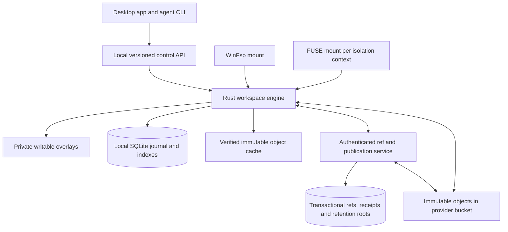

# TKFS architecture and implementation plan

Original planning baseline: 2026-09-27. Architecture revision: 2026-10-02.

Status: design only; no filesystem, storage service, or version-control implementation is implied. The current Telekinesis directory contains this plan only. The earlier proposal focused on offline file synchronization; the primary goal is now **a Git replacement for multi-computer agentic coding, with app-controlled mounted worktrees and an object bucket**. Useful local storage, recovery, platform, and namespace details are retained below. Timestamp-based automatic conflict winners and peer-converged mutable source trees are superseded by immutable project snapshots, explicit merges, and conditional ref publication.

Working assumptions, subject to the decision register in section 12: one user with several trusted devices and agents; Windows-first desktop experience; a single logical authority for shared refs; private offline work; whole-file immutable objects initially. A bucket provider, deployment platform, and concurrent Windows isolation mechanism have **not** been selected. Android document access remains a later extension rather than a prerequisite for coding.

For the minimal working PoC and thin CLI, read sections 19–20. Read sections 1 and 13–18 first for the product workflow and correctness contracts. Sections 2–9 retain and adapt the underlying filesystem design; sections 10–12 cover delivery, alternatives, and unresolved decisions.

## 1. Product contract: a versioned workspace, not just file synchronization

The user works at a familiar path, for example `C:\Work\Project`. TKFS owns the mounted namespace and routes filesystem operations into the selected worktree. The app creates, selects, checkpoints, compares, and merges worktrees. Every computer can mount its own view at the same conventional path; bytes are shared through immutable objects in a bucket, while each active writable worktree has its own local copy-on-write overlay.

The central workflow is:

1. Open **Project** on trunk at commit `T0`. The mount shows a tree derived from that exact commit, plus the current worktree's local edits.
2. Choose **New worktree** in the app. Create `W1` with base `T0`, an empty writable overlay, and a private branch/ref. This is a metadata operation; unchanged file bytes are shared, not copied eagerly.
3. Choose **Use this worktree**. After the switching safety barrier, `C:\Work\Project` presents `W1`. Editors and agents write through ordinary filesystem calls into `W1` only.
4. Save files locally and create a checkpoint/commit `S1`. A filesystem save is not automatically a project commit or a trunk update. Automatic recovery checkpoints may coexist with deliberate review commits.
5. Choose **Merge into trunk**. Resolve the common base `B` of `S1` and current trunk `T1`; compute a three-way merge of `(B, T1, S1)` in a separate merge worktree. Present code conflicts with base, trunk, worktree, and result panes.
6. Reuse object references for unchanged files; write new objects only for changed content and tree paths. Publish the complete merged tree through one conditional trunk-ref update. If trunk changed during review, retain the result and recompute against the new trunk before trying again.
7. Switch back to trunk through the same barrier. Keep the source worktree until the user explicitly retires it. A merge never erases uncommitted work or silently retargets running processes.

“Update refs for changed files” describes the storage optimization, not the visibility boundary: each immutable tree entry points to an immutable child object, and a single mutable branch ref points to a complete commit. Independently updating visible per-file refs would expose a half-merged project and cannot be the trunk publication protocol.

Required version-control behavior includes repository-wide snapshots, ancestry and merge commits, branches/tags, diff/status/log, restore/revert, explicit conflict resolution, recovery refs, and portable export. A first MVP can offer fewer Git commands, but must state its compatibility limits. A mounted folder and automatic sync alone do not replace Git.

Required filesystem behavior includes local read-after-write, atomic supported rename/replace operations, durable local flush, lazy verified hydration, stable timestamps during hydration, and clear unavailable-content errors offline. A successful local save, a local commit, remote byte durability, and shared ref publication are distinct states.

Two separate mount promises must remain visible in the product:

- **Sequential same-path selection:** one mount namespace shows one selected worktree at a time. Switching requires stopping or detaching affected processes safely.
- **Concurrent isolated views:** agents A and B both see `/workspace/Project` (or an equivalent Windows path) while each resolves it in a different OS isolation context. This requires separate mount namespaces, containers/VMs, or another proven isolation mechanism. A global path switch or a different PID is insufficient.

Default concurrency is one writable owner per worktree, with many independent worktrees and immutable readers. This is not a distributed coherent filesystem for multiple devices simultaneously editing the same mutable database. Shared trunk changes only through reviewed/authorized publication. Agents get scoped worktree capabilities; permission to edit files is distinct from permission to publish trunk, delete history, or administer storage.

## 2. Namespace model

The proposed namespace model uses stable entry IDs and parent/name relationships.

Use an **adjacency-list hierarchy for the local materialized worktree index**: each entry stores its parent's stable ID. Index by parent and normalized name to resolve paths segment by segment; reconstruct paths by following parent IDs. Keep directory/file type and content references separate from causal metadata and version history. This gives indexed direct-child listing, cheap directory moves, and stable identities through renames. A directory move changes its parent/name relationship without rewriting all descendants' paths. Normal enumeration needs no recursion. Recursive CTEs are useful for subtree operations, ancestry checks, and exports.

Tradeoffs: path lookup performs work proportional to path depth; subtree statistics need traversal or cached aggregates; parent pointers need cycle and same-share validation. Start with this model. Add path caches only after measurement. Nested-set numbering is a poor initial fit for frequent moves; a closure table adds storage and mutation work without solving the synchronization problem.

Change the following:

- Replace `isDirectory` plus `isFile` with one checked `kind` value.
- Replace business ownership (`idEmitente`) with a share identity and authorization policy.
- Replace the single storage pointer with separate entry, version, content, and local-object identities.
- Add portable name uniqueness, explicit timestamps, tombstones, synchronization history, and recovery records.
- Do not copy the current ASCII-only path validation. Define a Unicode-aware portable naming policy.

The persistent interchange format needs immutable trees as well as this mutable index. Rebuilding a published repository must be possible from its commit/tree objects plus authoritative refs; losing one device's SQLite file must not lose the only copy of project paths. Stable local entry IDs help handles and rename tracking, but tree paths and content are the portable version-control truth. A rename hint is not permission to choose a merge result silently.

## 3. Architecture and platform boundaries



The Rust core owns object encoding, worktree state, merge rules, recovery, and mount semantics. Adapters translate OS requests and errors; the UI and adapters never mutate database tables directly. The shared control service owns authoritative refs, publication receipts, permissions, and remote retention coordination. Local SQLite is authoritative for unpublished local work and a rebuildable index of published immutable history; it is not the only record of remote tree names or commit ancestry.

| Component | Working choice | Responsibility |
|---|---|---|
| Core and desktop daemon | Rust library/process | Storage rules, worktrees, mounts, durable local operations |
| Desktop UI | .NET/Avalonia candidate | Worktree selection, status, diff/merge, publication, recovery |
| Windows adapter | WinFsp through a thin native boundary | Filesystem callbacks and OS cache/handle behavior |
| Linux adapter | FUSE through a maintained binding or wrapper | Filesystem callbacks inside the intended mount namespace |
| Local control API | Versioned named pipe / Unix socket | Thin CLI and app forward intent/context; runtime owns all objects, refs, journals, and mounts; daemon independent of client lifetime |
| Shared metadata service | Small authenticated service with transactional store | CAS refs, operation receipts, authorization, retention roots |
| Bucket adapter | Explicit tested capability profile | Immutable upload/download, integrity, provider failure mapping |
| Later mobile adapter | Kotlin DocumentsProvider and Rust bindings | Browse/review/export/offline documents, not general coding mounts |

A single metadata-service instance can be an MVP deployment choice. Its data must be backed up and its failure mode documented; multiple independent writers against separate databases would break the authority contract. Service replication/failover must preserve linearizable ref updates and fencing. Do not start by building a custom consensus protocol.

WinFsp and FUSE provide OS interfaces, not the version-control engine. WinFsp supports cached and memory-mapped files, which means TKFS must account for cache-manager and mapping lifetimes; those capabilities do not establish that hot view switching is safe. [WinFsp design](https://winfsp.dev/doc/WinFsp-Design/), [WinFsp API](https://winfsp.dev/apiref/), [FUSE project](https://github.com/libfuse/libfuse).

The desktop UI framework and exact dependency versions remain spike decisions. Android can later expose documents through the Storage Access Framework, but this does not provide arbitrary POSIX paths to every application; mobile background execution also has lifecycle restrictions. Preserve the earlier provider concept without making it part of the desktop Git-replacement MVP. [DocumentsProvider](https://developer.android.com/guide/topics/providers/create-document-provider), [background work](https://developer.android.com/develop/background-work/background-tasks/bg-work-restrictions).

## 4. Identity and database model

The original local-file identity distinctions remain useful. Add repository, commit, ref, worktree, and mount identities; do not make one GUID represent several different things:

| Identity | Scope and purpose |
|---|---|
| `repo_id` / `share_id` | Repository and authorization boundary; decide whether general shares remain a separate product mode |
| `commit_id` / `tree_id` | Hash identity of immutable project history and namespace |
| `worktree_id` | Private base plus writable overlay; independent of mount path |
| `mount_id`, `mount_generation` | Mount instance and non-reused view epoch |
| `ref_name`, `ref_generation` | Mutable branch/tag name and monotonic update generation |
| `entry_id` | Stable local worktree entry identity through moves; portable history identity is a separate format decision |
| `version_id` | Immutable content-version identity shared between devices |
| `content_hash` | SHA-256 of exact file bytes; verifies content and enables reuse |
| `object_id` | Device-local GUID naming the stored bytes |
| `operation_id` | Globally unique mutation identity for idempotence |
| `device_id` | Paired device identity bound to its public key |

Example: laptop version V references hash H stored locally as object A. The phone learns V/H from metadata but already stores H as object B. It links V to B, without downloading A and without changing B's GUID. Remote object GUIDs may be advertised as opaque source locators; they are neither global identity nor proof of byte equality. Equal timestamps and lengths never prove content equality.

Retained local-file tables below are conceptual candidates, not a final schema. The authoritative version-control additions follow. Do not implement a competing peer-LWW engine from legacy table names:

| Table | Important columns and role |
|---|---|
| `devices` | ID, public key, pairing/revocation status, last contact |
| `shares` | ID, root entry, owner, format version, naming and conflict policy versions |
| `share_members` | Share/device permissions and membership epoch |
| `subscriptions` | Local alias, share, remote root, cache/pin policy, metadata completeness |
| `entries` | Materialized visible state: share/entry IDs, parent, display name, name key, kind, timestamps, current version, tombstone/projection status |
| `versions` | Version, entry, hash algorithm/hash, size, source timestamps, author and creating operation; no mutable byte contents |
| `version_parents` | Optional per-file recovery lineage; commit-parent graph is authoritative for repository merges |
| `objects` | Local GUID, hash, size, state, verification time, last access; unique verified content within its deduplication scope |
| `version_objects` | Version-to-local-object association; absent until hydrated |
| `replica_locations` | Share/version or hash, peer, advertised durability; a hint until verified |
| `operations` | Local overlay journal and idempotent operation IDs; not automatic remote tree mutations |
| `peer_cursors` | Optional later transport optimization; unnecessary for authoritative branch ordering |
| `transfers` | Durable download/upload queue, source, offset, expected hash, retries, error |
| `write_sessions` | Entry, base version, staging object, durable generation and recovery state |
| `pins` | Entry/subtree policy and completion progress |
| `conflicts` | Merge session, base/ours/theirs objects, reason, explicit resolution and retention state |
| `object_retention` | Local ownership, pin, pending upload, conflict, or history obligations |
| `schema_migrations` | Format and migration tracking |

Persistent permissions, supported attributes, and durable transfer/write state also belong in SQLite. OS file attributes on the opaque objects are implementation details. Transient handles, mutexes, and active buffers can remain in memory.

Use one repository root and one visible root per worktree, composite foreign keys to prevent cross-repository/worktree parents, and checks ensuring only files have content versions. UUIDs can be stored as 16-byte BLOBs with consistent wire encoding. Do not expose SQLite row IDs as distributed IDs or inode identities. Maintain stable local inode mappings when the adapter needs numeric identifiers.

Scope local entries and inode mappings by `worktree_id`; use an indexed current namespace with uniqueness of `(worktree_id, parent_id, name_key)` for visible live children. Keep conflicting candidates in the merge session rather than forcing both into the visible namespace or silently discarding either. Root uniqueness requires its own constraint because SQL NULL handling does not enforce one root automatically.

```sql
-- Illustrative listing over the resolved namespace, not complete migration DDL.
SELECT entry_id, name, kind, current_version_id, size_bytes,
       created_at_ns, modified_at_ns
FROM entries
WHERE worktree_id = ? AND parent_id = ? AND projection_state = 'visible'
ORDER BY name_key, entry_id;
```

SQLite configuration: foreign keys on, WAL mode, durable commits for acknowledged flushes, bounded busy handling, short write transactions, and one coordinated writer. Do not hold SQL transactions across network requests. Keep the database on a local native filesystem outside TKFS. Transfer immutable graphs and explicit ref requests, never the live database/WAL files. SQLite WAL explicitly requires cooperating processes to be on the same host. [SQLite WAL documentation](https://sqlite.org/wal.html).

Additional local tables/indexes: `commits`, `trees`, `worktrees(base_commit, overlay_generation, owner)`, `overlay_entries`, `local_refs`, `remote_ref_cache`, `merge_sessions`, `mounts`, `publication_outbox`, `object_pins`, and `recovery_roots`. Tree/commit caches must be rebuildable from verified objects; local dirty overlay records are not rebuildable unless checkpointed/backed up.

Authoritative service tables: `refs(repo, name, target, generation, policy)`, `publication_receipts(request_id, payload_hash, outcome)`, `ref_events`, `upload_sessions`, `retention_roots`, `memberships`, and optional fenced `leases`. The ref change, receipt, audit event, and retention-root transition belong in one service transaction. The object bucket is outside that transaction, handled through immutable upload followed by publication and GC coordination (section 15).

## 5. Object layout, writes, and recovery

Suggested persistent layout:

```text
TKFS/
  metadata.sqlite
  Data/
    objects/ab/cd/<object-guid>
    staging/<write-session-guid>
    incoming/<transfer-guid>.part
  logs/
  backups/
```

Windows defaults to `%LOCALAPPDATA%\TKFS`; Linux to `$XDG_DATA_HOME/tkfs` or `~/.local/share/tkfs`; Android uses internal application files storage. Android's disposable cache directory must never hold the only copy of a saved file. If storage roots become configurable, stage each object on the same volume as its final object directory.

Objects are immutable after publication. Writes use mutable staging files with random access. Deduplicated files must never share mutable backing storage. Start with whole-file objects and copy-on-write staging; large-file edits may require a full copy and rehash. Chunk manifests, sparse hydration, compression, and encryption-at-rest formats are later optimizations with explicit format versions.

Create the entry and a write session immediately so a newly created file is visible while open. Provide normal local read-after-write behavior through shared per-entry staging state. Create local immutable file generations at explicit durable flush and opportunistically at final close/cleanup (ordinary close alone is not a power-loss durability promise); the intended buffered-I/O design freezes a generation and resumes writes in new private staging. Where mapped I/O cannot be safely frozen/rebound, durable flush must instead journal durable mutable staging, with immutable capture delayed until writer quiescence. Never report a frozen immutable generation while mappings can still modify it. Local handles follow platform rules rather than each maintaining an incompatible private view. Remote refs must not modify any active overlay, dirty or clean; adopting a new base is explicit. A per-file durable generation is not yet an atomic project checkpoint.

Local durable file-generation publication sequence (distinct from section 15 shared-ref publication):

1. Freeze a staging generation; compute its size and hash outside the database transaction.
2. Flush its bytes. Reuse an existing verified immutable object if its content matches; otherwise atomically rename into the object store on the same filesystem and perform the platform's required durability barriers.
3. Commit version, object association, metadata, local journal/outbox record, and retention obligation in one SQLite transaction.
4. Only then acknowledge the durable flush and make that committed version eligible for object upload; only an explicit project commit/ref action publishes history.

The database transaction and object rename are not one atomic transaction. This ordering prevents committed local versions from referring to incompletely written bytes. A crash before the SQL commit may leave an orphan, which is safe to collect only after recovery excludes pending writes/transfers. A crash after commit must recover the published object and queued operation. Device/storage failures that violate flush guarantees remain outside application guarantees.

On startup recover staging sessions, validate incomplete publication, resume transfers, and detect missing/corrupt objects. Never mark a partial download as complete. Expose recovery failures rather than serving truncated data. A successful explicit durable-flush/fsync request promises local durability under the declared platform contract; FUSE flush/close callbacks must not be confused with fsync; ordinary buffered writes do not imply power-loss durability or remote replication.

Garbage collection uses reachability plus retention obligations. Never evict dirty data, unreplicated locally authored data, pinned versions, open handles, retained conflict versions, or the last promised durable copy. Cached remote objects are evictable only when their source/retention policy makes refetch acceptable. Keep a reserve for metadata commits and staging; report disk-full errors before falsely acknowledging success.

Backup must capture a consistent SQLite snapshot plus every object it references under a GC barrier. Opaque GUID files alone cannot reconstruct names and directory structure. Provide an export/recovery CLI and periodic object verification.

Whole-project checkpointing adds a worktree mutation barrier: quiesce writers, drain supported buffered/mapped writes, freeze one overlay generation and its namespace, and create one immutable root tree. Hashing can run outside the metadata transaction only after the captured bytes cannot change. Either hold the barrier until capture completes or use a proven generation-preserving copy-on-write mechanism; never hash files that applications can still mutate. Serialize rename/delete/content capture to the same boundary.

This captures a filesystem-consistent cut, not an application transaction across files. A build that requires all generated files from one application operation must stop/cooperate before checkpointing. Persistent writer handles that continue after a checkpoint must attach to the new mutable generation while the captured generation stays immutable; this requires adapter-specific validation, especially for mappings. The MVP may require all writers closed for a checkpoint, instead of pretending a flush alone solves this.

## 6. Remote objects, metadata, and publication

The bucket stores immutable blobs, trees, and commits. The control plane stores authoritative mutable refs and associated policy. Devices cache objects and materialized indexes locally, with durable outboxes for unpublished work. A branch update changes what future explicit checkouts select; it does not stream new files into an agent's running worktree.

| Operation | Contract |
|---|---|
| Read refs | Authenticated target plus monotonically increasing generation; freshness recorded |
| Fetch commit/tree | Verify hash/type/format; enumerate only complete known metadata |
| Fetch blob | Stream/resume, check complete length and digest, atomically install verified local object |
| Begin upload | Register temporary retention root/session before objects can race collection |
| Upload missing objects | Idempotent immutable writes; no blind overwrite of content-addressed bytes |
| Publish ref | Compare expected old target **and generation**, authorize, verify protected object closure, atomically record new target and receipt |
| Query publication | Resolve ambiguous network outcome using request ID, not a fresh unconditional retry |
| Subscribe/poll ref events | Refresh cached ref knowledge; events are hints with sequence/rescan recovery |
| Pin/export | Capture explicit commit/root and verify all required descendants are available |

A receiving device may learn about a commit before downloading its bytes. It must distinguish metadata-known, metadata-complete, and content-available states. An unfetched directory is not empty. A new commit's unavailable blob must not be substituted with older bytes. Full metadata for the selected snapshot is the initial default; sparse trees are a later feature with explicit completeness states.

Use authenticated HTTPS plus bounded streaming/range transfers. Keep SQL transactions short and outside network requests. Direct device-to-device transfer may later accelerate verified blob reuse, but a peer advertisement is neither authoritative history nor evidence that the promised remote durability level was met. The bucket enables asynchronous device handoff without both devices being online.

Offline, an agent can edit available content and create local commits/private refs. It cannot claim successful shared-trunk publication without the authority. On reconnect, upload its immutable graph, refresh trunk, merge if needed, and submit CAS publication. No arrival-order or wall-clock winner changes history.

Discovery is not authentication. Bind device identities to keys, authenticate repository access, and scope agent tokens to specific worktrees/actions. A digest is not an access token. Avoid cross-tenant deduplication initially. Revoked devices retain previously downloaded data; reject future publication while keeping their local edits exportable. Never distribute bucket administrator or object-deletion credentials to coding agents.

## 7. Offline behavior

| Local state in the selected worktree | Read while offline | Write while offline |
|---|---|---|
| Complete verified current version | Yes | Yes |
| Pinned subtree fully hydrated | Yes for the pinned snapshot | Yes; queue private commit upload |
| Metadata only | List/stat, but content read fails as unavailable | New file or deliberate full replacement can work; partial edit requires base bytes |
| Partial download | No complete-file promise in v1 | No partial edit until base is complete |
| New local unsynchronized file | Yes | Yes; protected from cache eviction |
| Newly learned version with only older bytes cached | Current version unavailable | Explicit recovery/history access may use old bytes; no silent substitution |

Pinning is complete only after both metadata traversal and required downloads finish. New local children and descendants adopted during an explicit base update inherit a folder pin policy; a fixed snapshot pin itself never changes. Display pending/failed pinning and quota limits. A pin records an immutable root and verified closure. Tracking a branch for future pin refresh is a separate policy and does not change the mounted base. Stale devices revalidate authorization and ref generations before publication. Retired private drafts need explicit retention rules; never infer safe deletion from a device being offline.

“Continue on another computer” means checkpoint and upload first, then open the checkpoint in a new worktree on the other computer. Moving exclusive ownership of an existing worktree requires a handoff token/fencing epoch and confirmation that its latest checkpoint is durable. If the old device is offline, create a fork; do not pretend to transfer mutable dirty state that has never left that device. Offline autonomy and a globally exclusive writable worktree cannot both be guaranteed during a partition.

## 8. Timestamps and conflicts

Keep explicit `created_at`, user-visible `modified_at`, local metadata-change time, and diagnostic ingestion time, with documented range, precision, and platform rounding. Preserve supported timestamps when hydrating a version. Nanosecond storage does not mean nanosecond clock accuracy.

**Timestamps never decide code merge winners or ref ancestry.** The earlier literal mtime last-writer-wins proposal is retired for repositories: clocks, restored timestamps, and editor behavior cannot identify the correct change. Concurrent edits remain separate commits until an explicit merge/rebase resolves them. A later general-purpose file-sync mode could choose LWW with private recovery, but it would be a separate policy and not the coding default.

Commit parent links establish ancestry; the ref generation establishes publication order. Author timestamps are descriptive only. A merge records all parents even when one parent's content is selected unchanged. “Revert” creates a new commit undoing a chosen change; moving a ref backward is a separate privileged history rewrite with a recorded old target and retention protection.

Source trees store exact bytes and portable executable/type metadata. Do not let atime, hydration time, or incidental mtime change blob identity or create code diffs. Whether reproducible source mtimes live in a separate immutable metadata manifest is an open format decision. Cache invalidation on view changes must work even when size and mtime coincide.

Conflicts are explicit persistent merge-session records containing base, ours/trunk, theirs/worktree, result, path/type/mode information, and resolved status. Binary conflicts, delete/edit, rename/edit, rename/rename, add/add, file/directory collisions, case collisions, symlinks, and directory cycles require deliberate outcomes. Retain both candidate graphs until resolution and the configured recovery period expire. Code conflict markers may be shown/written in a disposable merge worktree; never insert them silently into shared trunk. See section 16 for the merge transaction.

## 9. Filesystem semantics and boundaries

Implement these before treating the mounted drive as usable:

- Create/open/read/write at arbitrary offsets, truncate, append, flush, cleanup/close, stat, enumeration, mkdir, rename, replace, unlink, rmdir, and timestamp/attribute updates.
- Atomic rename/replace within a share, including common editor temporary-file save sequences. Cross-share moves initially return a cross-device result so applications can copy and delete.
- Stable entry identity across rename; defined open-handle behavior on delete/replace; shared local writer serialization and OS share/access flags.
- OS cache invalidation and directory-change notifications after local changes and explicit base/view changes; remote ref discovery alone does not mutate the view.
- No database writer lock held during slow downloads; request cancellation, bounded queues, and mapped platform errors.
- Portable case-preserving, case-insensitive names in v1, using a pinned/versioned normalization and case-fold algorithm. Reject collisions, Windows reserved names, forbidden characters, trailing dots/spaces, and traversal components. Do not use SQLite's built-in ASCII-oriented NOCASE as the complete Unicode policy.
- Preserve supported user metadata explicitly. Define creation time, mtime, access-time policy, executable bit, read-only flags, and the portable permission subset. Start with a private per-user mount and repository/worktree authorization. Capture executable bits for cross-platform code even when the host cannot execute them.
- Specify hard links, symlinks/reparse points, alternate data streams, extended attributes, sparse files, and local locks individually. Unsupported operations must fail explicitly. Real package managers use links, so rejecting all links limits the compatible project set; either support the needed semantics or keep dependency installations in per-worktree native scratch storage. Never turn an unsupported symlink into an ordinary text file silently. Distributed byte-range locking is out of scope.

Do not promise full NTFS/POSIX compatibility merely because the driver supports it. Test memory-mapped access and local locks; document unsupported application workloads. Live databases, VM disks, and competing application lock files across offline peers need stronger coordination than independent worktrees and are not supported distributed workloads in v1.

Mount-local entry identity and kernel file/inode identity must be scoped to the worktree and generation, not just an identical path. Treat open directory enumerators, working directories, file IDs, watcher registrations, and memory mappings as live references. Remote namespace changes must never be projected into an in-use tree behind those references. Section 17 defines switch behavior.

Maintain a declared workload matrix rather than a blanket filesystem-compatibility claim: chosen editor/language server, source build toolchain, dependency manager, test runner, antivirus/indexer interaction, and large binary assets. Validate atomic editor saves, rename-over-existing, delete-on-close/share modes, append races, executable loads, notifications/overflow, long paths, permission failures, and mmap. Local locks work within one mounted worktree; ordinary lock files do not coordinate independent devices.

## 10. Staged MVP and release gates

| Phase | Deliverable | Exit criterion |
|---|---|---|
| 0: design/feasibility | Object/ref spec, backend capability matrix, WinFsp/FUSE handle and switch spike | Explicit supported-workload contract; prove or narrow mapped-I/O/checkpoint and switching guarantees |
| 1: local versioned store | Immutable blobs/trees/commits, durable overlay journal, local refs, import/export, status/diff/log | Whole-project recovery across every write boundary; object/hash and tree invariants hold; export reproduces bytes/modes |
| 2: one Windows mounted project | Create a COW worktree, write, checkpoint, select another at same path after quiescence | Real editor/build workflow; no cross-worktree writes; dirty edits preserved; switch fails safely when busy |
| 3: local merge workflow | Common-base merge, persistent conflicts, review result, conditional local trunk update | Disjoint edits combine; overlapping/binary/namespace cases require resolution; concurrent trunk change cannot be overwritten |
| 4: bucket plus shared refs | One tested provider, publication service, upload/pin/recovery, second computer | Partition and ambiguous-response tests pass; locally durable vs remotely durable vs published states are accurate |
| 5: desktop agent beta | Scoped agent CLI, multiple private worktrees, process lifecycle, backup/restore | Concurrent agents have isolated mutations, scoped tokens, reproducible test evidence, and safe retirement |
| 6: stronger isolation and portability | Linux mount namespaces; evaluate Windows container/VM/session alternatives; Git bridge | Same literal path concurrently only on validated isolation backends; import/export round trips documented |
| Later | Chunking/packs, sparse hydration, Android review, optional P2P, richer history UX | Driven by measured limits; core correctness and restore gates remain passing |

First vertical slice: import Project at `T0`, mount it, create `W1` without duplicating all file bytes, safely select it at the same path, edit two files, checkpoint `S1`, show a diff, merge, and switch to the resulting trunk. Second slice: another computer advances trunk before `W1` publishes; prove a disjoint change is preserved and an overlap yields an explicit conflict. Third slice: kill the daemon or drop the network at each durability/publication boundary and recover.

Early agents on Windows can use distinct native mount paths while human-driven same-path switching matures. Concurrent same-path views are a separate feature gate. Keep UI small until the store, mount, and merge invariants work. Sections 19–20 narrow this release roadmap into a CLI-first PoC; the thin CLI is introduced with the first local runtime, not postponed to the desktop-agent beta. Original time estimates for a file-sync beta do not apply to this expanded scope; estimate after the feasibility spikes.

Suggested eventual repository organization (planning only): `tkfs-core` for commits/worktrees/merge rules, `tkfs-store` for local objects/journals/indexes, `tkfs-remote` for bucket and publication clients, `tkfs-control` for authoritative ref service, platform adapters, daemon, CLI, desktop UI, protocol/format fixtures, and failure/compatibility tests. A dedicated namespace sync engine is no longer the primary architecture.

Before beta, measure large-tree listing, metadata hydration, cold/warm checkout, worktree creation, first-write amplification, checkpoint hashing, merge cost, random I/O, watcher storms, object counts, bucket requests/egress, local storage growth, and restore time. Report hardware, OS, provider/region, latency, file count/size distribution, and cache state. Use measured budgets; do not promise constant-time fully usable checkout or native-filesystem speed from metadata-only fork cost.

## 11. Existing systems and build-versus-adopt

| Reference | Reuse or learn from | Boundary |
|---|---|---|
| Git object/history model | Content-addressed blobs/trees/commits, parent graph, merge base, refs, explicit worktrees | TKFS adds lazy mounted views and app-managed lifecycle; a new format carries substantial interoperability cost |
| Git worktree/ref/merge implementation | Separation of shared objects from per-worktree state, conditional ref changes, three-way merge handling | Sharing objects never means sharing mutable index/HEAD or running processes |
| JuiceFS | Filesystem/metadata/object-store separation, data slices, metadata transactions, cache/invalidation mechanisms | Shared filesystem coordination is not automatically version-control branches, repository commits, or offline merge semantics |
| Seafile/SeaDrive | Hydration, offline pins, cache UX | Useful mount experience; not by itself the proposed agent branch/merge workflow |
| Syncthing | Transport/reuse and offline sync experience | Folder convergence and conflict copies are a different contract |
| rclone mount | Backend adapters and buffering tradeoffs | A bucket mount alone supplies neither repository snapshots nor safe ref publication |

Primary references: [Git objects](https://git-scm.com/book/en/v2/Git-Internals-Git-Objects), [Git worktrees](https://git-scm.com/docs/git-worktree), [JuiceFS architecture](https://juicefs.com/docs/community/architecture/), [SeaDrive](https://help.seafile.com/drive_client/drive_client_for_win10/), [Syncthing synchronization](https://docs.syncthing.net/users/syncing), [rclone mount](https://rclone.org/commands/rclone_mount/).

Evaluate three implementation strategies before committing to a new history format: (A) Git-compatible object/commit/ref storage under a new filesystem UX; (B) native TKFS trees/commits with a Git import/export bridge; (C) a mounted filesystem over an existing Git engine. A Git replacement can replace the user's workflow while retaining Git-compatible internals. Native format freedom must pay for review hosting, IDE integrations, blame/bisect, import/export, and recovery tools. JuiceFS is a source of filesystem design patterns, not proof that its existing metadata model provides isolated branch histories.

Source inspection should pin a commit and identify exact files/functions before code reuse. Inspect licenses and portability before adopting code; no source is copied by this planning task. Research findings can extend this section without implying implementation or validation.

### Source-code findings: Git and JuiceFS

Source review supplied for this revision is pinned to Git `c44beea485f0f2feaf460e2ac87fdd5608d63cf0` (v2.51.0) and JuiceFS `adcca1cc61bb4d668a945d64b2e176b44ac8e5b5` (2026-09-29). These observations motivate TKFS design choices; they do not claim either project implements this complete workflow.

- **Git's persistent graph:** object hashing includes a typed header and payload; trees serialize entries and reuse valid cached subtrees; commits encode a root tree and parents. Borrow the separation of immutable content, namespace, and ancestry. [Object hashing](https://github.com/git/git/blob/c44beea485f0f2feaf460e2ac87fdd5608d63cf0/object-file.c#L503-L526), [tree reuse](https://github.com/git/git/blob/c44beea485f0f2feaf460e2ac87fdd5608d63cf0/cache-tree.c#L257-L297), [commit serialization](https://github.com/git/git/blob/c44beea485f0f2feaf460e2ac87fdd5608d63cf0/commit.c#L1656-L1697).
- **Git separates merge computation from installation:** `merge_incore_nonrecursive` computes from base and two sides, while `merge_switch_to_result` installs into index/worktree. TKFS should compute a private immutable result before changing a mount or shared ref. Preserve structured conflicts, not just marker text. [Merge API](https://github.com/git/git/blob/c44beea485f0f2feaf460e2ac87fdd5608d63cf0/merge-ort.h#L99-L134), [rename/delete handling](https://github.com/git/git/blob/c44beea485f0f2feaf460e2ac87fdd5608d63cf0/merge-ort.c#L3104-L3152).
- **Ref checks are not a multi-file reader snapshot:** Git checks expected old values, but its update-ref documentation warns that concurrent readers can observe only some of a multi-ref update. TKFS's default uses one trunk root, then pins each process/session view separately. [Expected-value checks](https://github.com/git/git/blob/c44beea485f0f2feaf460e2ac87fdd5608d63cf0/refs/files-backend.c#L2503-L2534), [reader warning](https://github.com/git/git/blob/c44beea485f0f2feaf460e2ac87fdd5608d63cf0/Documentation/git-update-ref.adoc#L158-L162).
- **JuiceFS separates metadata and object storage:** Redis metadata includes inode attributes, directory entries, slice references, sessions, and locks; its transaction wrapper uses WATCH/retry. Chunk object keys use numeric slice/block identifiers, so content-addressed deduplication is not implied. [Metadata schema](https://github.com/juicedata/juicefs/blob/adcca1cc61bb4d668a945d64b2e176b44ac8e5b5/pkg/meta/redis.go#L57-L86), [transaction wrapper](https://github.com/juicedata/juicefs/blob/adcca1cc61bb4d668a945d64b2e176b44ac8e5b5/pkg/meta/redis.go#L1140-L1194), [chunk keys](https://github.com/juicedata/juicefs/blob/adcca1cc61bb4d668a945d64b2e176b44ac8e5b5/pkg/chunk/cached_store.go#L62-L79).
- **JuiceFS clone is a useful but different primitive:** it traverses metadata and creates new inodes, shares data slices, and attaches the completed detached destination. The traversal can encounter disappearing source entries. This is not evidence of constant-time persistent-root branching or a point-in-time source snapshot. [Clone traversal](https://github.com/juicedata/juicefs/blob/adcca1cc61bb4d668a945d64b2e176b44ac8e5b5/pkg/meta/base.go#L3384-L3575), [slice sharing](https://github.com/juicedata/juicefs/blob/adcca1cc61bb4d668a945d64b2e176b44ac8e5b5/pkg/meta/redis.go#L5346-L5475), [destination attach](https://github.com/juicedata/juicefs/blob/adcca1cc61bb4d668a945d64b2e176b44ac8e5b5/pkg/meta/redis.go#L5846-L5882).
- **Handle and cache state survives pathname decisions:** JuiceFS binds handles to inode/reader/writer state, and its FUSE operations use node and file-handle IDs. It also has optional Redis broadcast invalidation for attribute/entry caches, with reconnect purging; this is not comprehensive chunk-cache invalidation or isolated branch views. [Handles](https://github.com/juicedata/juicefs/blob/adcca1cc61bb4d668a945d64b2e176b44ac8e5b5/pkg/vfs/handle.go#L32-L62), [FUSE operations](https://github.com/juicedata/juicefs/blob/adcca1cc61bb4d668a945d64b2e176b44ac8e5b5/pkg/fuse/fuse.go#L243-L288), [metadata invalidation](https://github.com/juicedata/juicefs/blob/adcca1cc61bb4d668a945d64b2e176b44ac8e5b5/pkg/meta/redis_csc.go#L46-L168).
- **Writeback completion needs a defined durability scope:** JuiceFS's optional writeback path can acknowledge local staging before object upload, and VFS fsync uses its writer Flush path. TKFS must explicitly gate remotely durable publication on both object availability and authoritative metadata durability. [Writeback path](https://github.com/juicedata/juicefs/blob/adcca1cc61bb4d668a945d64b2e176b44ac8e5b5/pkg/chunk/cached_store.go#L388-L465), [fsync](https://github.com/juicedata/juicefs/blob/adcca1cc61bb4d668a945d64b2e176b44ac8e5b5/pkg/vfs/vfs.go#L1036-L1058). Physical slice compaction must not change TKFS file-version identity.

Linux FUSE distinguishes direct, cached write-through, and writeback behavior; mmap support and delayed writes depend on the selected mode/capabilities. Choose and test one explicit adapter configuration instead of deriving TKFS guarantees from generic FUSE support. [Kernel FUSE I/O modes](https://docs.kernel.org/filesystems/fuse/fuse-io.html).

## 12. Open decisions and working defaults

| Decision | Working default | Evidence needed before commitment |
|---|---|---|
| History/storage format | Native model described below; evaluate Git-compatible internals before implementation | Round-trip cost and tooling requirements; canonical format fixtures |
| Shared authority | One logical transactional ref service plus immutable bucket | Deployment/backup ownership, availability needs, failover fencing |
| Bucket-only alternative | Optional constrained provider-specific design, not default | Verified conditional-write semantics, discovery, auth, retention/GC, ambiguous-outcome handling |
| Windows same-path scope | Sequential quiescent switching first | WinFsp cache/mapping tests; isolation backend for concurrent same-path agents |
| Linux same-path scope | Separate mount namespaces for concurrent agents | Privilege/user-namespace policy, propagation isolation, child-process tests |
| Worktree write ownership | One device/agent owner; multiple agents get separate worktrees | Handoff/revocation/fencing protocol; collaboration requirements |
| Checkpoint granularity | Explicit full project checkpoint, optional private recovery checkpoints | Writer barrier cost; partial-commit demand; mapped I/O limits |
| Trunk policy | Explicit three-way merge, fast-forward or merge commit, expected-target/generation CAS | Approval/review/test requirements; protected ref authorization |
| Local/remote durability | Distinct local flush, object availability, ref publication, replica policy | Provider guarantees, disaster-recovery RPO/RTO, verified restore drill |
| Names and links | Portable names initially; explicitly measured code-tool compatibility | Linux case-sensitive projects, symlink/hard-link-heavy dependencies |
| Object granularity | Whole-file SHA-256 blobs and immutable directory trees | Large-file edits, object-request cost; chunking/packing crossover |
| Ignored data | Explicit tracked selection; per-worktree scratch/cache; secrets excluded | Git import behavior, build cache identity, environment overlays |
| Retention | Reachable shared history retained; provisional 30-day recovery roots for retired drafts | Quotas, user deletion controls, offline device policy, backup retention |
| Mobile/P2P | Later extensions | Desktop version-control workflow proven first |

These are architectural defaults to make tradeoffs reviewable, not approval to install, deploy, or implement anything. The next design milestones are the object format, ref API, merge semantics, checkpoint barrier, and mount lifecycle specification.

## 13. Immutable object graph and copy-on-write worktrees

### 13.1 Canonical persistent model

```text
mutable ref: refs/heads/trunk -> {commit: C7, generation: 42}
commit C7 -> {root_tree: R7, parents: [C6, S3], author, message, format}
tree R7 -> sorted entries {name, kind, portable_mode, child_object_id}
blob H  -> exact immutable file bytes
worktree W -> {base_commit: C7, overlay_generation: 9, owner, local_head}
mount M -> {worktree: W, mount_generation: 12, isolation_context}
```

Object identity is a domain-separated hash over type, format version, canonical length/encoding, and payload. Define canonical ordering, Unicode encoding, integer encodings, supported modes, maximum sizes/depth, and unknown-field handling; reject malformed trees, duplicate names, cycles, or type mismatches. Use a versioned algorithm identifier so future migration is explicit. The hash verifies bytes, not authorship; authorization/signatures are separate.

Tree objects persist names and relationships. A snapshot is a root tree; a commit couples a snapshot to parents and provenance. Two commits may reference the same tree. Empty directories may be representable in TKFS even though a Git bridge needs a policy for them. Symlink targets, if supported, are literal versioned targets with their own type and sandbox rules. Source file modes matter; platform ACLs and owner IDs should not be imported into a portable source commit accidentally.

Stable `entry_id` values remain useful for local handles and rename hints. Proposed default: do not make local inode IDs part of portable tree identity. Infer renames during merge using changes and content, and store optional explicit rename intent separately; if persistent cross-commit entry IDs are selected instead, specify copy/rename/import semantics before encoding them.

Suggested bucket keys are scoped by repository/security domain and object format, for example `repos/<repo>/objects/v1/sha256/<prefix>/<digest>`. Local GUID filenames can remain an implementation detail indexed by hash. Never confuse an object ETag, local GUID, and TKFS content digest. Compression/encryption must define whether the logical hash covers plaintext and how ciphertext is verified; begin with provider transport/at-rest protection unless client-side encryption is explicitly required. Client-side encryption changes key recovery, deduplication, and server-side graph validation.

### 13.2 Overlay semantics

A worktree resolves each path from its private overlay first, then its immutable base. Overlay operations include create, replace/content-write, metadata change, rename, and whiteout/tombstone to hide a base path. A directory deletion/rename must operate on one consistent local namespace transaction, not millions of eagerly rewritten descendant paths. Do not resurrect deleted base children during overlay compaction or directory recreation.

Forking starts with an empty overlay and a base pointer. Default creation forks the selected committed head. If Project has dirty edits, the app must either preserve them in the current worktree or explicitly checkpoint that state as the new fork base; never silently discard or carry them into an unrelated worktree. First modification hydrates required base bytes and creates private staging storage; unchanged blobs/trees remain shared. Initially copying a whole file on first write is acceptable and measurable. A truncate-to-zero/full replacement can avoid fetching old bytes; a partial write cannot fabricate missing bytes. Reflinks are an optional native-storage optimization only when available and verified. Never use writable hard links to immutable objects.

At checkpoint, materialize only changed tree paths, reuse identical blobs/subtrees, and create a commit from one frozen overlay generation. Overlay growth can be compacted locally without altering commit history. Worktree creation may be cheap while first listing, metadata loading, first write, and cold builds remain expensive; expose those costs.

The mounted overlay may contain tracked source, untracked candidate files, and explicitly ignored scratch. Define tracked selection and ignore rules before automatic checkpoints; ignored secrets must not be uploaded by accident. Keep build output, dependency installs, temporary files, and tool databases in per-worktree scratch or explicitly routed native directories. Do not infer that every filename seen through the mount belongs in history. A first release may offer full tracked-tree commits only; partial-file/hunk staging is a later, explicitly missing Git feature.

## 14. Agent and multi-computer concurrency

Allocate a worktree and capability for each independent task. Bind local handles to `(repo, worktree, mount generation, entry, data generation)` as appropriate; a later UI selection must never reinterpret an existing handle against a different worktree. Child processes inherit the intended isolation context. Shared compiler daemons, language servers, task runners, and helper services outside that context need explicit routing or separate instances.

An agent lifecycle is: allocate from a named commit; acquire local ownership; launch process tree; edit; stop/cooperate for checkpoint; record commit and test evidence; request merge; resolve/review; publish conditionally; retire only after retention obligations are settled. Use idempotent request IDs on lifecycle and publication operations. Audit records include task/agent/device identity, source/base/result commits, and authorization principal; an author label alone is not authentication.

Do not give two disconnected devices an authoritative lease on the same writable worktree. A server lease can reduce online collisions but cannot prevent an offline machine editing old local bytes. If leases are introduced, use server-issued increasing fencing epochs on publication and ownership changes; expiry based on local wall time is not sufficient. A stale owner can retain/export its draft but cannot publish as the current owner. Prefer creating a new worktree over complex mutable-state migration.

Concurrent branches are expected, not an error. Shared refs require serialized conditional updates, not global locks on all file editing. In particular, agents A and B can start at `T0`, commit independently, and merge sequentially into trunk without one agent replacing the other's files. Ref collisions trigger merge/retry, never unconditional overwrite. Read-only review/build mounts pin a commit so a concurrent branch movement cannot change their input halfway through execution.

The app must control its backing store through per-user permissions and private IPC. “All mounted directory I/O goes through our app” does not mean the app controls tools writing elsewhere, arbitrary administrator access, or shared services outside the agent sandbox. Repository permissions and process isolation are separate concerns; symlinks/reparse points must not become unauthorized escape paths.

## 15. Atomic shared publication and provider guarantees

### 15.1 Default protocol: immutable upload, then one ref transaction

Example request shape (illustrative, not an implemented API):

```text
PublishRef(repo, ref, expected_commit, expected_generation,
           new_commit, request_id, upload_session, policy_evidence)
```

1. Persist the local commit and publication intent durably. Allocate a unique request ID and bind it to a payload hash; reuse of that ID with different contents is invalid.
2. Register a remote upload session/retention reservation. Upload missing immutable objects, with bounded retries, integrity verification, and conditional create or equivalently safe immutable semantics.
3. Establish that the new commit's transitive closure is complete in the required storage tier. This includes referenced trees and parent history required by the repository's completeness policy. A trusted closure index can amortize checks; unverified client claims or successful upload of only the commit object cannot prove this.
4. Outside long database transactions, validate the graph, naming rules, merge policy, and evidence. Protect checked objects against GC throughout validation and publication. Revalidate mutable authorization/policy epochs inside the final transaction.
5. In one service transaction compare the current ref target and generation with both expected values; check authorization; move the ref; increment its generation; convert/upload-retain the object root into a published retention root; record receipt and audit event. **This transaction commit is the shared publication linearization point.**
6. Reply with the durable receipt and new generation. Release the temporary upload root only after the published root protects the objects. Notification delivery is retriable and not the source of truth.

A changed expected target/generation yields a conflict response containing the current head; it never overwrites it. Generations prevent an ABA mistake when a ref moves `A -> B -> A`. Force updates require a different explicitly privileged action with old-tip recovery retention. Branch creation compares absence; deletion compares an expected generation and leaves an audit/tombstone so recreation cannot reuse an old generation.

If the response is lost, query the request receipt. Do not assume failure and mint an unrelated retry. The ref may have advanced again after a successful publication, so reading only its current target cannot determine the original request's outcome. Requests queued offline must refresh policy and authorization before publication.

### 15.2 The bucket is not a distributed transaction manager

Amazon S3 documents strong object consistency and atomic updates of an individual key, but not atomic transactions across independent keys. Its conditional-write API can reject a stale ETag or an existing key. These are specific provider/API guarantees, not promises inherited by every “S3-compatible” service. Use the documented conditions and error handling for the selected service and bucket class. [S3 consistency](https://docs.aws.amazon.com/AmazonS3/latest/userguide/Welcome.html#ConsistencyModel), [S3 conditional writes](https://docs.aws.amazon.com/AmazonS3/latest/userguide/conditional-writes.html).

The provider qualification checklist is: immutable creation/overwrite prevention; visibility after acknowledged writes; conditional update behavior under races; ETag/version-token semantics; multipart completion/abort; range reads; checksums; quotas/throttling; region/replication durability; permissions/revocation; retention/lifecycle deletes; retryable vs terminal errors. Test the exact SDK/API path. A checksum field must not be assumed equal to a TKFS hash, and a request timeout does not prove an object was not stored.

**Alternative: bucket-only refs.** A provider with sufficiently strong single-key conditional writes can host a ref object containing target, generation, and receipt information. Upload the graph first, then CAS that key. This can support a narrow single-ref publication contract. It still needs a specified protocol for branch discovery, durable idempotency history, authorization, protected refs, audit, multi-ref changes, and GC/upload races. Versioning is recovery support, not a repository transaction. If the provider lacks reliable CAS, use the metadata service; blind overwrite/LWW is unacceptable. A single coordinator may serialize writes, but its lease/failover must itself be fenced.

Default MVP: one ref per publication, no atomic multi-repository or multi-ref operation. If later needed, the metadata service can transact a defined ref set or publish one immutable ref-map root. Do not simulate an atomic multi-ref change by writing individual bucket keys and hoping readers do not observe the interval.

## 16. History, three-way merges, and review

The merge engine takes immutable commits, not a directory that may change while being scanned. Let `S` be the source worktree commit, `T` current trunk, and `B` their common ancestor. If the graph has multiple merge bases, either implement a documented virtual-base algorithm or stop for explicit resolution in the MVP; do not choose an arbitrary ancestor. No common ancestor requires an explicit unrelated-history/import operation.

For a simple path: if source equals base, use trunk; if trunk equals base, use source; if both equal each other, use either identical object; otherwise attempt a three-way text merge or create a conflict. Compare tracked bytes/type/mode, not mtime. Namespace changes must be considered across paths: rename detection is a heuristic/hint unless the format stores identity, and rename/delete/type/case conflicts need explicit handling. A clean textual merge is not proof of semantic correctness.

The common-base example that the MVP must pass:

```text
T0: config=A, parser=P
S1 (parent T0): config=A, parser=P+agent-change
T1 (parent T0): config=A+other-change, parser=P
M  (parents T1,S1): config=A+other-change, parser=P+agent-change
publish trunk only if it is still (T1, expected_generation)
```

Merge in a new isolated worktree pinned to `(B,T,S)`. Store every conflict and its resolution durably. Show base/trunk/source/result, support choosing either side or editing, and require all structural/content conflicts resolved before publication. Abort discards the merge session's tentative result while retaining both source commits and the source worktree. Resume restores conflict state after restart.

Run tests/review on the exact frozen result tree/commit and record toolchain/environment evidence. If tests write generated files, keep them in scratch or produce a new result checkpoint and rerun required validation; evidence for one tree does not approve another. An authority may require signed/trusted CI evidence for protected trunk, rather than accepting an untrusted agent assertion.

Then publish `M` using the expected trunk target/generation. If trunk moved to `T2`, recompute using the new graph and repeat affected review/tests. Previously resolved conflicts may be reused only when their base/ours/theirs inputs still match; do not blindly transplant a resolved file over newer edits. Preserve the rejected candidate for inspection. A no-op merge and an already-ancestor source should be identified without creating misleading work.

For repeated merges, preserve source ancestry or an explicit verified integration baseline. Leaving every worktree permanently anchored to its original fork while discarding merge ancestry can reintroduce already merged edits. A source worktree may continue its own branch after merge; later merges derive the base from retained commit parents, not a stale UI label.

Provide `status`, `diff`, `log`, `branch`, `checkpoint/commit`, `restore path from commit`, `revert`, and `merge` concepts even if the app labels them differently. Rebase/cherry-pick can follow; history rewrites must preserve recoverable old commits. Tags pin immutable commits and should be protected from accidental movement. Reflog-like history records old/new refs and request identity; deletion and retirement do not immediately garbage-collect reachable history.

Git interoperability is a product requirement to decide, not a transparent assumption. Existing IDEs, hooks, CI, hosting, blame/bisect, submodules, and large-file extensions expect Git behavior. Start with explicit import/export and commit-ID mapping if using a native format; refuse or document unsupported modes/links/submodules rather than silently changing them. Never expose a fake `.git` directory implying unsupported commands work.

## 17. Same-path switching and concurrent mount isolation

### 17.1 Why changing a root pointer is insufficient

A path is resolved in an OS namespace. In one ordinary namespace, the same path cannot simultaneously name independent trees for arbitrary applications merely because they have different PIDs. Routing selected callbacks by PID is unsafe as a design shortcut: cached I/O, kernel workers, mappings, inherited handles, helper processes, and shared daemons need not preserve the originating agent's identity at every request.

Linux mount namespaces provide separate mount views. Use an app-managed namespace/container per agent, with mount propagation isolated and child processes launched inside it; verify privileges and host policy rather than assuming unprivileged namespace creation works everywhere. [Linux mount namespaces](https://man7.org/linux/man-pages/man7/mount_namespaces.7.html).

Windows ordinary drive mappings have documented global/local logon-session visibility, not arbitrary per-agent PID isolation. Consequently, a drive-letter or directory mount by itself is not evidence of concurrent same-path isolation. Separate VMs/containers or carefully tested logon-session mechanisms are alternatives; exact path visibility, services, child processes, and WinFsp support need proof. Until then, concurrent Windows agents use distinct mounts while the UI supports sequential same-path selection. [Windows device namespaces](https://learn.microsoft.com/en-us/windows/win32/fileio/defining-an-ms-dos-device-name).

### 17.2 Sequential switching state machine

```text
ACTIVE(W1, epoch N)
  -> PREPARING (validate W2 and preserve W1)
  -> QUIESCING (block new work; stop/cooperate with process tree)
  -> DRAINED (flush/checkpoint, close handles/maps/watchers)
  -> REBINDING (unmount/remount or proven cache-safe generation switch)
  -> ACTIVE(W2, epoch N+1)
```

Persist a switch intent with old/new worktree and epoch before rebind. On restart, inspect actual adapter state and either finish safely or remount the old view; never guess from only the UI selection. All control operations carry expected worktree/epoch to reject stale app actions. An unavailable target, failed drain, or failed cache invalidation leaves the old view active, or the mount explicitly unavailable during recovery; it must not expose a mixture.

MVP sequence: validate the target's metadata and required pin policy; checkpoint or keep dirty W1 as a private overlay; stop managed writers/builds/language servers; require editors to close affected files or cooperate; flush; establish that mappings/handles are drained; unmount/remount at the same path; recreate watchers and restart managed tools. Prefer refusal with an actionable busy reason over forced redirection. An unmount/remount may have a visible unavailable interval; do not market it as an atomic operation for arbitrary live processes.

The daemon can track its handles but cannot assume it can safely stop every host process or infer all mapping lifetimes from a zero ordinary-handle count. Successful adapter-supported quiescence/unmount plus tested OS behavior is the gate. Unmanaged terminals with a current directory under the mount, Explorer, indexers, scanners, and compiler daemons can block or complicate switching. A supported managed-run mode is more credible than transparent hot switching of all arbitrary applications.

| Resource | Required behavior |
|---|---|
| Open file/directory handles | Remain bound to their original view; never redirect future writes to W2. MVP requires closure before switch |
| Memory mappings/executables | Mapping and delayed writeback may outlive ordinary handles; drain/unmap or reject switch/checkpoint |
| Kernel page/dentry/attribute caches | Use distinct identities/epochs and validated invalidation or remount; no old pages under new tree metadata |
| Watchers | Re-register after rebind and send a rescan/view-change signal; overflow requires full reconciliation |
| Working directories/relative paths | Restart or relocate affected processes; a retained directory handle can keep resolving the old view |
| IDE buffers/language servers | Preserve unsaved buffer state and reload deliberately; app cannot infer an editor buffer belongs to W2 from its pathname |
| Child/helper/background processes | Track the full managed process context; terminate/restart cooperatively or refuse switching |
| Build/dependency caches | Namespace by worktree/result/environment or validated content key; same absolute path is not a cache identity |

Linux documents that closing a descriptor does not unmap an existing mapping. Windows separately documents mapped-view and file flush responsibilities. These are reasons to test the barrier, not to assume flushing one ordinary handle drains every dirty mapping. [Linux mmap](https://man7.org/linux/man-pages/man2/mmap.2.html), [Windows FlushViewOfFile](https://learn.microsoft.com/en-us/windows/win32/api/memoryapi/nf-memoryapi-flushviewoffile).

Atomic ref publication only selects a coherent root for a new reader; it does not make successive file opens by an unpinned process a transaction. Active worktrees remain pinned until an explicit lifecycle transition.

An advanced alternative can pin old readers and their old view while new opens see W2, but any process performing multiple opens can then see mixed generations. That model needs cooperative session binding and explicit semantics; it is not the default “safe hot switch.” Never allow a stale writer to publish into W2.

### 17.3 Build cache and notification policy

Use `(repo, worktree or immutable result tree, toolchain, platform, dependency lockfiles, environment/config)` as appropriate for cache identity. Mutable incremental outputs and compiler databases are private per worktree; global immutable dependency/download caches may be shared when the tool guarantees safe concurrent access. Cache keys based only on path/size/mtime are invalid across views. Ports, sockets, temporary directories, credentials, and process names also need task isolation where relevant.

If source mtimes are preserved, a switch must still invalidate affected tool state. Restarting tools or using isolated cache directories is safer than falsifying source mtimes to force rebuilds. FUSE cache configuration and invalidation need an explicit tested policy, particularly if backing contents can change outside an open file's expected lifetime. [libfuse cache configuration](https://libfuse.github.io/doxygen/structfuse__config.html).

## 18. Invariants, failures, retention, and validation

### 18.1 Non-negotiable invariants

1. **Immutable identity:** a published object ID always resolves to the same verified type/bytes; a partial/corrupt object is never served as complete.
2. **Snapshot coherence:** one commit refers to one complete valid tree from one captured worktree generation; per-file saves are not substituted for this boundary.
3. **Isolated writes:** writes, delayed writeback, and handles cannot cross worktree or mount generations because a UI selection changed.
4. **No lost branch update:** ref publication compares expected target and generation; concurrent trunk work survives or produces a conflict.
5. **Graph before ref:** shared refs never intentionally point to an unverified/incomplete remote graph; published roots remain protected from GC.
6. **Honest durability:** acknowledged local flush survives the supported crash model; UI never labels local-only work remotely durable/published.
7. **Offline preservation:** unpublished local data and unresolved conflict inputs cannot be evicted to satisfy an ordinary cache limit.
8. **Explicit conflict:** ancestry/content determine merge cases; wall clocks and arrival order cannot discard code changes.
9. **Namespace validity:** each visible tree respects kind, parent, name uniqueness, normalization, and no-cycle rules.
10. **Recoverable operations:** request receipts, merge sessions, switch intents, and local journals make retry/restart unambiguous.
11. **Authorization:** editing a private worktree is not permission to move protected refs or delete shared history.
12. **Portable recovery:** exported objects/history/refs can be verified and restored without one particular device's SQLite cache.

### 18.2 Failure scenarios and required outcomes

| Failure/race | Required result and validation |
|---|---|
| Crash before object fsync/rename | Partial staging not published; recover or report last durable generation |
| Crash after object install, before local SQL commit | Orphan harmless; recovery checks pending sessions before collection |
| Crash after durable local checkpoint | Commit and overlay roots recover; upload can resume idempotently |
| Crash/network loss halfway through graph upload | Trunk unchanged; incomplete upload protected temporarily and retryable |
| Publish succeeds but reply is lost | Query receipt returns outcome; no duplicate/conflicting ref mutation |
| Two agents publish against the same generation | Exactly one succeeds; other retains source/candidate and merges against the new head |
| Trunk moves during conflict review | Stale CAS fails; old resolution is not silently applied over new work |
| Switch requested with open mapped writer | Refuse/drain safely; old writes never land in new worktree |
| Crash during mount rebind | Intent/epoch recovery yields old or new view, or explicit unavailable state; no blended namespace |
| Full disk or quota during staging/commit | Return accurate error; keep last durable state; reserve metadata recovery capacity |
| Corrupt cache/blob download | Quarantine/refetch if possible, otherwise surface error; no fallback to wrong-version bytes |
| GC races a new upload/publication | Upload/root barrier protects closure before final CAS; collector cannot delete newly reachable data |
| Service outage or split authority | Local private work continues; shared publication unavailable rather than conflicting authoritative histories |
| Revoked/stale device reconnects | Publication rejected; local work remains exportable; no deletion resurrection from stale cached metadata |
| Case/type/rename collision | Explicit merge/import conflict; no path silently disappears |
| Bucket lifecycle removes referenced object | Detect broken repository health, restore from retained backup, block false durability claims |
| Lost local metadata/device | Published graph restored from bucket + ref backup; unpublished-only work loss reported honestly |

### 18.3 Retention and disaster recovery

Separate local cache eviction from remote history collection. Remote roots include branches/tags, retained ref events, merge inputs/results, private uploaded drafts, active upload sessions, pins, and backup manifests. Local roots additionally include dirty overlays, open handles/maps, unreplicated commits, and recovery journals. A removed worktree is not evidence that its commits are no longer needed.

Use mark-and-sweep with an explicit GC epoch/barrier or equivalent transactionally protected root protocol. A time grace period alone does not make concurrent publication safe. An upload session must protect existing reused objects as well as newly uploaded ones; otherwise deduplication can race deletion. Finalize publication only while the whole closure is protected, and coordinate sweeper deletion with newly acquired roots. Start with remote GC disabled or conservatively retaining everything until this protocol is validated. Lifecycle rules must not delete reachable object prefixes independently.

Do not promise unlimited offline history with finite storage. Retain local unpublished roots indefinitely unless the user explicitly discards/exports them; stop further writes when space is exhausted. Define a separate policy for remote private-draft expiry, report impending expiry, and allow renewal. Reachable shared history is retained unless explicit history-retention policy says otherwise. Record tombstones/generations for deleted refs and revalidate stale clients.

Back up the control database (refs, receipts, authorization/policy, retention roots) plus the graph it protects under a consistent backup root/barrier. Include format versions, recovery manifests, and encryption-key recovery where applicable. Object hashes alone cannot recover current branch names or prove which publication was accepted. A collection of local GUID files alone cannot recover project paths; immutable tree objects can. Test a clean-machine restore and verify every reachable object. RPO/RTO, remote replication tier, and region/device-loss claims remain explicit decisions; a provider's durability claim is not proof that all drafts were uploaded or backups are usable.

### 18.4 Validation gates

These are required future implementation checks, not tests executed during this document revision:

- Fault-inject every local object/SQL boundary and every upload/ref/receipt/switch boundary. After restart, enumerate all acknowledged roots and verify bytes, graph integrity, and declared durability.
- Race N publishers against one expected ref generation, including ABA movement, duplicate requests, timeouts, and authorization changes. Verify one successful transition per generation and retained unsuccessful candidates.
- Run randomized isolated worktree histories with offline intervals; merge the same immutable inputs repeatedly and compare results/conflict records. Exercise common-base, multiple-base, rename/delete, binary, mode, case, and directory cases.
- Hold file/directory handles, mmap regions, cwd references, watchers, child processes, and compiler daemons across a requested switch. Verify refusal or the supported binding semantics on each target OS; force delayed writes to detect cross-worktree leakage.
- Exercise actual selected toolchains: editor atomic saves, package-manager link requirements, language-server rescans, build/test generation, long paths, permissions, and dependency caches. Compare cold/warm and switched results against clean exported builds.
- Simulate corrupt/partial objects, unavailable bucket/service, throttling, expired credentials, full disk, incomplete pins, stale clients, and competing GC. Recovery must preserve local-only work and never show stale bytes as current.
- Restore from a control-plane backup plus bucket contents on a clean machine; recreate refs/trees, verify exact bytes/modes/history, and export to a conventional directory/Git bridge with unsupported cases reported.

Passing mount smoke tests is necessary but insufficient. Beta requires evidence for all invariants on the declared supported workload/platform/provider matrix, with remaining limitations visible in the app and documentation.

## 19. Thin CLI and runtime-owned operations

### 19.1 Observed implementation state

At the time of this design, the repository contained only the initial plan;
filesystem and runtime behavior was proposed rather than implemented. This
section records the original greenfield approach. Consult the repository
README and current plan for the implemented architecture and prerequisites.

### 19.2 Ownership and transport

`tkfs` is a small utility with familiar `branch`, `checkout`, and `merge` verbs. It parses flags, captures the caller's working directory, connects to the local runtime, sends a versioned request, renders progress/results, and exits. **The runtime performs path resolution, authorization, capture, hashing, object storage, ref changes, merging, and mount transitions.** The CLI never writes SQLite, the object bucket, or mounted backing files directly. The desktop app is another client of the same API.

Use one Rust workspace for the runtime, thin CLI, and shared protocol/domain types; this minimizes a second runtime/language dependency while leaving the later .NET app free to use the same protocol. For Windows PoC use an authenticated per-user named pipe with restrictive ACLs and bounded length-prefixed JSON messages. JSON is adequate for control requests; file data flows through the mount or bounded streaming storage APIs, not base64 in CLI messages. Validate protocol version, message size, method, IDs, and enum values. The runtime remains running when the CLI exits. Unix sockets and Linux packaging follow only when the Windows slice works.

The remote ref/object-upload service is distinct from local mount RPC, even if implemented as a second mode of the same executable. Do not expose the local mount-control pipe as an unauthenticated network endpoint. The remote service can initially run as one instance on one chosen always-on computer, with SQLite on its native local disk and one serialized writer. It owns shared ref transactions; clients own private worktrees.

### 19.3 Resolve cwd into an explicit stable context

The CLI supplies its absolute `cwd`, or a documented `-C <directory>` override, to `ResolveContext`. The runtime returns:

```text
{repo_id, worktree_id, mount_id, mount_generation,
 worktree_generation, local_head_commit, local_ref_generation,
 relative_path, runtime_instance_id, context_token}
```

Resolve against a runtime-maintained mount registry and OS path identity, not by searching parents for a mutable marker file or matching string prefixes. A nested path resolves to its enclosing registered mount; path-component boundaries, case/normalization policy, drive aliases, UNC paths, and reparse points must be handled deliberately. A PoC can reject ambiguous aliases or reparse traversal and unsupported nested mounts rather than resolve the wrong project. `C:\Work\Project-old` must not match `C:\Work\Project`. A path outside all registered mounts gives `NOT_A_TKFS_PROJECT` unless an explicit authorized project/worktree selector is supplied.

Treat cwd as context, not proof of access. Verify the caller via named-pipe OS identity and the runtime's project/worktree authorization. In future concurrent namespaces the same path can identify different mounts; context must additionally include a runtime-validated isolation/session capability. Do not infer isolation or authority from PID alone.

A mutating request carries the returned context token and expected generations. The runtime rechecks them under the relevant operation lock before execution. A checkout between resolution and mutation yields `STALE_VIEW`; a worktree edit/capture race yields `STALE_WORKTREE` or a new explicitly captured generation. Never silently re-resolve a stale request to whatever branch is currently mounted. After daemon restart, invalidate context tokens or validate persisted epochs through a new runtime-instance binding.

The local view generation and remote ref generation are independent: one rejects stale mount actions, the other rejects stale trunk publication. Branch creation should carry an explicit resolved base commit. A merge session records immutable source/base/target commit IDs and the target generation; it must not reinterpret a moving branch name later.

### 19.4 Command semantics for the PoC

The following syntax is proposed and must be documented before implementation. Names intentionally resemble Git, but differing behavior must be visible in help and results.

| Command | Runtime action and safety contract |
|---|---|
| `tkfs status` | Resolve cwd; show project/worktree/view IDs, base/head, dirty state, merge state, local/remote durability, and known remote generation |
| `tkfs branch <name>` | Create a private local ref and empty COW worktree record from the resolved committed head; do not switch. Dirty files remain with the old worktree and are explicitly reported as excluded |
| `tkfs checkpoint -m <message>` | Under the writer/capture barrier, create an immutable project commit and advance its private local ref atomically; preserve an idempotent receipt |
| `tkfs checkout <name>` | Resolve a unique eligible local worktree for the branch; hydrate required metadata, quiesce, then select it at the same mount path. Ambiguous ownership needs `--worktree <id>` |
| `tkfs checkout <name> --checkpoint` | First capture dirty work in the old worktree using the same barrier, then switch; if capture or drain fails, do not switch |
| `tkfs fetch` | Refresh shared refs and required graph metadata; do not change the selected overlay or running process view |
| `tkfs merge <source> --into trunk` | Pin source and target commits/generation, compute in a separate merge worktree, return a durable session with conflicts or a ready candidate; no remote ref moves yet |
| `tkfs checkout --merge-session <id>` | Safely select the session's private result worktree at the normal path for conflict editing and tests |
| `tkfs resolve <path>` | Explicitly record an edited/selected resolution for that conflict; do not infer resolution merely from absent marker strings |
| `tkfs merge --continue <session>` | Validate all conflicts resolved; freeze the exact result and create candidate commit with both parents; return `READY_TO_PUBLISH` |
| `tkfs merge --abort <session>` | End the session without moving trunk; preserve source commits and any draft needed by recovery policy |
| `tkfs publish --merge <session>` | Upload/verify the graph, then conditionally move shared trunk from the session's expected target/generation. Stale trunk returns `REF_CONFLICT` and retains candidate |
| `tkfs operation <request-id>` | Read durable operation/receipt state after timeout or CLI restart; never repeat a destructive mutation blindly |

Separating merge preparation from publication keeps the initial workflow inspectable. A later app button or convenience flag may combine them using the same persisted state machine and explicit policy. This PoC deliberately does not claim drop-in Git command compatibility. Ordinary `checkout` refuses dirty tracked edits with `DIRTY_WORKTREE`; `--checkpoint` is the explicit preservation route. Untracked and ignored files belong to their original worktree's overlay/scratch and never move implicitly into the target. No force-discard switch is needed for the PoC.

For a dirty Project that should become a new branch, use `checkpoint` first, then `branch`, then `checkout`; branch creation does not secretly capture a moving live tree. For a clean working tree whose editor still holds files open, checkout may still return `BUSY_VIEW`. Dirty-state policy and process quiescence are independent gates.

### 19.5 Request lifetime, retries, and checkout from a shell

Mutating calls include a client-generated `request_id`, canonical payload hash, resolved context, and expected relevant generations. The runtime persists the accepted intent before irreversible transition and returns durable operation state. Same ID/same payload returns the same operation/result; same ID/different payload is rejected. For a completed checkout retry, consult its receipt before rejecting the now-old mount generation. An interrupted caller does not imply runtime cancellation: `operation` reports whether a checkpoint, switch, or publish finished. Cancellation is best effort before the commit point and never rolls back a successful publication implicitly.

Use explicit outcomes such as `DIRTY_WORKTREE`, `BUSY_VIEW`, `STALE_VIEW`, `STALE_WORKTREE`, `OFFLINE_OBJECT_MISSING`, `MERGE_CONFLICTS`, `REF_CONFLICT`, `UNSUPPORTED_FS_OPERATION`, and `PERMISSION_DENIED`. Provide human output and `--json` with stable error/status codes. Every result should identify the affected project/worktree and resulting generations so agents can verify what happened.

The calling shell itself can retain a cwd/directory reference under the mount. The CLI can capture cwd and leave the mount in its own process, but cannot move its parent shell. Therefore a full remount-based checkout must have an explicit PoC escape hatch: run from outside the mount with `-C` or an authorized project selector. Do not claim every in-mount shell supports seamless checkout before testing this on Windows.

Illustrative proposed flow; these verbs describe the legacy design rather than the current CLI:

```powershell
# Parent shell stays outside the mount during checkout.
Set-Location C:\Work
tkfs -C C:\Work\Project branch agent-task
tkfs -C C:\Work\Project checkout agent-task
# Open editor/build in Project, make changes, then close affected processes.
tkfs -C C:\Work\Project checkpoint -m "Parser change"
tkfs -C C:\Work\Project fetch
tkfs -C C:\Work\Project merge agent-task --into trunk
# If needed: select the returned merge session, edit/resolve/test, then continue.
tkfs -C C:\Work\Project publish --merge <session-id>
# Fetch/import the published tip into an idle trunk worktree, then select it.
tkfs -C C:\Work\Project checkout trunk
```

The final checkout explicitly adopts the authoritative published tip only after preserving any local trunk worktree state; it does not replace a dirty or independently advanced local head. Initial PoC can make trunk read-only except in isolated merge sessions, reducing ambiguity. After a remote CAS failure, fetch the new trunk and create/recompute a merge session; do not implement `--force` as the retry path.

## 20. Smallest end-to-end working PoC

### 20.1 Scope and concrete technology choices

Build one Windows-first repository with ordinary UTF-8 text files and directories, one mount at `C:\Work\Project` per computer, whole-file SHA-256 blobs, canonical immutable trees/commits, SQLite local journals/indexes, a Rust runtime, and the thin Rust CLI. Use WinFsp through a narrow native adapter after the driver/binding spike. Keep the backing store outside the mount. A local per-file COW staging copy is adequate; byte-level chunking and packfiles are unnecessary for proving branch isolation.

Use Rust with the MSVC toolchain, Windows SDK/linker and WinFsp SDK/runtime for the Windows prototype; verify their compatibility with the native adapter. Start with one binary in separate `daemon`, `cli`, and later `serve` roles if that reduces deployment work; maintain module boundaries without creating many services/crates prematurely. No desktop UI, Android integration, or distributed metadata cluster is required to demonstrate the idea.

For the remote slice, choose **one** real bucket provider and use the section 15 control-service design. A concrete qualification target is an AWS S3 general-purpose bucket because its relevant semantics have documented sources; an already available provider can substitute after the same capability tests. No provider/account/credentials have been inspected or provisioned. The minimal ref service uses one local SQLite database, one owner process, and expected-value transactions. It need not depend on bucket CAS for refs. Initially proxy bounded object uploads through that service so it can verify hashes and record durable availability; presigned direct uploads and distributed closure verification can wait. Transport/authentication must still protect actual source code and credentials.

For three-way text merging, pick a deterministic existing merge primitive only after a small fixture spike. If Git is available, invoking a pinned/validated `git merge-file` against private temporary base/ours/theirs files is an acceptable **PoC-only helper**, if its actual installed command behavior, binary detection, conflicts, and licensing/distribution implications are checked. The runtime still owns TKFS commits, refs, trees, merge sessions, and publication. This optional helper is not a dependency on a live Git repository and is not a final engine choice. Alternatively select a maintained embeddable three-way merge implementation after checking compatibility. Do not write a new diff3 engine before proving mounted worktrees. Detect namespace/binary conflicts separately and require explicit resolution. The documented primitive accepts current/base/other file inputs and reports unresolved merges; pin actual helper behavior before adoption. [Git merge-file documentation](https://git-scm.com/docs/git-merge-file).

Constrain the history demo to a single known common ancestor and ordinary fork/merge commits. Reject unsupported criss-cross/multiple-base or unrelated histories explicitly; implementing arbitrary topology is not a PoC requirement. Defer automatic offline reconciliation: offline checkpoints are preserved, and reconnect uses explicit fetch/merge/publication. Disable remote collection and retain all PoC objects.

Non-goals: concurrent same-path views on one Windows host; transparent switching with arbitrary live processes/mappings; Linux/Android delivery; P2P/discovery; shared writable worktrees across devices; full NTFS/POSIX compatibility; huge repositories/large-file optimization; automatic semantic code merging; Git CLI/hosting compatibility; partial-hunk staging; history rewriting; multi-user permissions beyond scoped trusted-device access; HA/failover; remote GC. Keep unsupported operations explicit. Use plain-file fixtures initially, then one deliberately selected real code workload without unsupported symlink/hard-link requirements.

### 20.2 Implementation order and stop/go gates

| Step | Build/prove | Acceptance gate before proceeding |
|---|---|---|
| P0: mount and toolchain spike | Verify WinFsp installation/ABI and Rust/native build; mount a tiny app-owned namespace and record callbacks for create/read/write/flush/rename/close | A real external editor/PowerShell process performs mounted I/O; busy handles and safe unmount behavior are observed. Driver examples alone do not count as TKFS storage |
| P1: local store plus RPC | Canonical blobs/trees/commits; local SQLite journal; one owner daemon; thin CLI; cwd resolution and operation receipts | Import a fixture, checkpoint/export exact bytes, restart daemon, recover refs; reject wrong cwd, duplicate-ID payload change, and stale context |
| P2: real mount backed by the store | Wire WinFsp callbacks to private staging and immutable-base reads, with local durability and error mapping | Editor save/replace/rename/delete, list/stat and restart work through the mount; acknowledged writes survive daemon termination under the defined local durability model |
| P3: COW branch and same-path checkout | Branch from fixed commit; separate overlays; dirty policy; quiesce and remount/generation switch | A and B retain independent edits at the same path sequentially; unchanged bytes shared; busy writer rejects switch; old request cannot write to new view |
| P4: local merge and conflict UX | Base/ours/theirs tree merge; merge-session worktree; text helper; structured conflict records; local expected-ref checks | Disjoint edits combine; overlapping, add/add, delete/edit, mode/type and binary conflicts are explicit; resolution survives restart; source work remains intact |
| P5: one bucket and ref service | Verified immutable uploads; full graph retention; SQLite ref CAS+receipt transaction; fetch/status/publish | Two clients race the same expected target/generation: one wins, one conflicts. Lost response is resolved via receipt. Trunk never points to a graph that failed upload |
| P6: two-computer demonstration | Same conventional mount path on separate machines; offline draft on B; A advances trunk; B fetches/merges/publishes | Both changes preserved for disjoint edits; overlap requires resolution; other machine explicitly checks out the merged commit; no automatic mutation of active view |
| P7: recovery and repeatability | Fault injection at key boundaries; saved runbook/fixtures; clean export/restore | Repeated scripted demo passes, orphan uploads harmless, local-only data retained, saved refs/objects restore on a fresh client |

Group these steps into four demonstrable gates: **mounted I/O and consistent capture (P0–P2)**; **A → B → A at one path (P3)**; **mounted three-way conflict resolution (P4)**; and **two runtimes competing safely for one trunk generation (P5–P7)**. A whole-file conflict can be the first P4 smoke test, but line-level three-way text merging must pass before calling the code-merge experience complete. No additional feature is needed merely to finish the broader release roadmap.

P0 addresses the largest platform unknown early, but do not broaden its throwaway callback spike into a full filesystem before P1 establishes the store contract. P1–P4 form a useful single-machine proof; P5–P7 are required before claiming the requested multi-computer Git-replacement PoC. The utility CLI is small, while runtime storage correctness, mount lifecycle, and merge/publication behavior dominate the work. Calendar estimates should follow P0, not assume those unknowns away.

### 20.3 A single reproducible acceptance scenario

Use a fixture repository with two independently editable text files, one overlapping text file, a binary file, a nested directory, and an ignored scratch directory. Keep known hashes and exact expected trees. Begin with trunk `T0` on both machines.

1. Machine A creates worktree `task-a`, selects it at `C:\Work\Project`, changes `parser.txt` via ordinary mounted I/O, and checkpoints `A1`. Verify `T0` and another worktree still have their original bytes and the unchanged blob objects were reused.
2. Machine B creates `task-b` from `T0`, edits `config.txt` offline, restarts its runtime, and verifies that its acknowledged local state survived. A missing uncached blob returns an availability error; a full replacement/new file still works within the documented contract.
3. A prepares a merge and publishes trunk `T1`. B reconnects, uploads its checkpoint, fetches `T1`, merges from the common base, and publishes `M` containing both edits. The fixture's binary/namespace conflicts are resolved separately in dedicated cases.
4. Repeat with both machines editing overlapping lines. The merge session must stop with explicit base/trunk/source/result information. Edit the result through the mounted merge worktree, record resolution, checkpoint the candidate, and publish only after its required validation.
5. During B's review, let A publish another trunk change. B's stale publication must fail without losing any objects or changing trunk. Recompute against the new head; ensure the additional A edit survives.
6. Submit the same publication request twice, lose the first response, and query the receipt. Verify one logical ref transition and an unambiguous result even if trunk has subsequently advanced again.
7. Keep a file writer, directory watcher, and mapped-file test process alive while requesting checkout. The PoC either proves its supported drain path or returns `BUSY_VIEW`; it never redirects old writes. Retry from an outside-mount shell after closing them and confirm the path now resolves only the target worktree.
8. Terminate the daemon/service at the object-install, checkpoint-commit, upload-complete, ref-transaction, and switch-intent boundaries. Check the recorded recovery outcome; verify every acknowledged commit/ref and retained draft. Do not describe process-kill tests as proof of power-loss or disk-controller durability.
9. On a fresh client with empty cache, restore authoritative refs and graph from the service/bucket, hydrate the selected commit, and compare exported bytes/tree to the fixture. Local-only drafts lost with their sole device must be reported as outside that remote recovery guarantee.

The demo succeeds only when the runtime owns real mounted I/O and ref publication end to end. Copying ordinary directories, switching a symlink without lifecycle handling, or simulating bucket calls in memory is useful preparatory testing but does not satisfy this acceptance scenario.

### 20.4 Critical risks, dependencies, and immediate next design work

- **Mount lifecycle:** native driver deployment, ABI/toolchain, Windows share modes, cache manager, mappings, and parent-shell cwd behavior. First dependency: a working, observed P0 adapter and a narrow supported-workload contract.
- **Capture consistency:** writer barriers must freeze directory and content state together; distinguish durable staging from immutable commits. First specification: exact checkpoint state machine and unsupported mmap behavior.
- **Context/retry races:** cwd can resolve differently after checkout; request timeouts can happen after success. First specification: generation/token validation, durable operation receipts, and recovery transition order.
- **Merge scope:** a text helper does not resolve renames, binary/type/case conflicts or semantic bugs. First specification: deterministic tree merge cases and structured conflict/session format.
- **Remote authority/durability:** acknowledged bytes, complete graph, accepted ref, and replicated backup are different facts. First dependency: selected bucket profile, reachable authenticated single-owner service, provisioned credentials, and conditional-ref schema; none exist in this folder yet.
- **Tool compatibility:** ignored scratch, executable metadata, editor notifications, dependency links, and caches can invalidate a convincing toy demo. First decision: one real target project/toolchain and explicitly supported filesystem features after the fixture gate.

Before implementation, finalize five short contracts inside the design: canonical object encoding, local RPC envelope/errors, overlay/capture journal transitions, sequential checkout lifecycle, and publication/ref receipt schema. Then implement P0/P1. This assessment authorizes no installs, service deployment, infrastructure changes, or coding by itself; those are follow-on work once requested.
